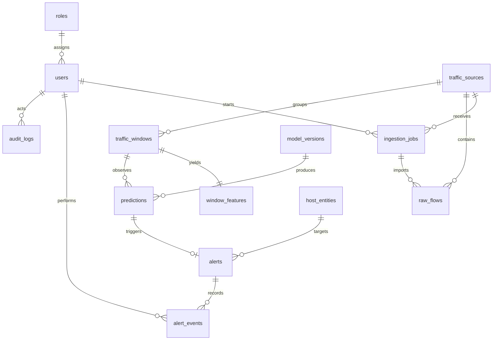

# Database schema v1

PostgreSQL is the system of record. Timestamps are stored as `timestamptz` in UTC; IDs are UUIDs. Every table has `created_at`, and mutable records also have `updated_at`.

## Forecasting invariant

A prediction is about a future target interval, not the interval that supplied its features:

```text
observation window [10:00, 10:01)
        -> features/model -> forecast target [10:01, 10:06)
```

`predictions.observation_window_id`, `forecast_window_start`, and `forecast_window_end` are therefore required. This makes it possible to demonstrate and evaluate actual forecasting.

## ERD



## Tables

| Table | Key columns and purpose |
| --- | --- |
| `roles` | `id`, `name` (unique: `admin`, `analyst`, `viewer`), `description`. |
| `users` | `id`, `role_id`, `email` (unique), `password_hash`, `display_name`, `is_active`, `last_login_at`. Never store plaintext passwords. |
| `traffic_sources` | `id`, `name`, `source_type` (`csv_replay` for MVP), `description`, `is_active`, `created_by_user_id`. |
| `ingestion_jobs` | `id`, `traffic_source_id`, `requested_by_user_id`, `original_filename`, `content_hash`, `status` (`pending`, `running`, `completed`, `failed`), `total_rows`, `accepted_rows`, `skipped_rows`, `error_message`, `started_at`, `completed_at`. |
| `raw_flows` | `id`, `traffic_source_id`, `ingestion_job_id`, `observed_at`, `src_ip`, `dst_ip`, `src_port`, `dst_port`, `protocol`, `packet_count`, `byte_count`, `duration_ms`, `tcp_flags`, `failed_connection`, `extra_json`. This is normalized input, not an unvalidated CSV row. |
| `traffic_windows` | `id`, `traffic_source_id`, `window_start`, `window_end`, `window_seconds`, `scope_type` (`source`, `host`, `flow`), `scope_key`, `flow_count`, `packet_count`, `byte_count`. One row represents one aggregate scope for one fixed interval. |
| `window_features` | `id`, `traffic_window_id` (unique), `feature_schema_version`, `features_json`, `is_complete`, `missing_fields_json`. JSONB is used only after the feature-name/version contract is frozen. |
| `model_versions` | `id`, `name`, `version` (unique with `name`), `feature_schema_version`, `artifact_uri`, `metrics_json`, `is_active`, `trained_at`. |
| `predictions` | `id`, `observation_window_id`, `model_version_id`, `forecast_window_start`, `forecast_window_end`, `risk_score` (0-100), `risk_level`, `predicted_attack_type` (nullable), `confidence_score` (0-1), `is_fallback`, `is_uncertain`, `is_ood`, `explanation_json`, `created_at`. |
| `host_entities` | `id`, `traffic_source_id`, `ip_address`, `hostname` (nullable), `entity_type`, `first_seen_at`, `last_seen_at`; unique on source/IP. |
| `alerts` | `id`, `prediction_id` (unique), `target_host_id` (nullable), `title`, `summary`, `severity`, `status` (`open`, `acknowledged`, `investigating`, `resolved`), `recommended_actions_json`, `created_at`, `updated_at`, `resolved_at`. |
| `alert_events` | `id`, `alert_id`, `actor_user_id`, `event_type`, `from_status`, `to_status`, `note`, `created_at`. This is append-only. |
| `audit_logs` | `id`, `actor_user_id` (nullable for system events), `action`, `resource_type`, `resource_id`, `request_id`, `ip_address`, `metadata_json`, `created_at`. This is append-only. |

## Required indexes

```text
users(email) UNIQUE
raw_flows(observed_at)
raw_flows(src_ip, dst_ip)
traffic_windows(traffic_source_id, window_start, window_end)
window_features(traffic_window_id) UNIQUE
predictions(created_at DESC, risk_level)
predictions(forecast_window_start, forecast_window_end)
alerts(status, severity, created_at DESC)
ingestion_jobs(traffic_source_id, status, created_at DESC)
host_entities(traffic_source_id, ip_address) UNIQUE
audit_logs(created_at DESC)
```

## Constraints and lifecycle rules

- `window_end > window_start`; `forecast_window_end > forecast_window_start`.
- `risk_score` is between 0 and 100; `confidence_score` is between 0 and 1.
- A completed ingestion job cannot be changed back to `running`.
- An alert is created only for a qualifying prediction, and is unique per prediction.
- Status changes write both `alerts` and a new `alert_events` record in one transaction.
- ORM queries and migrations must use parameter binding; no interpolated SQL.

