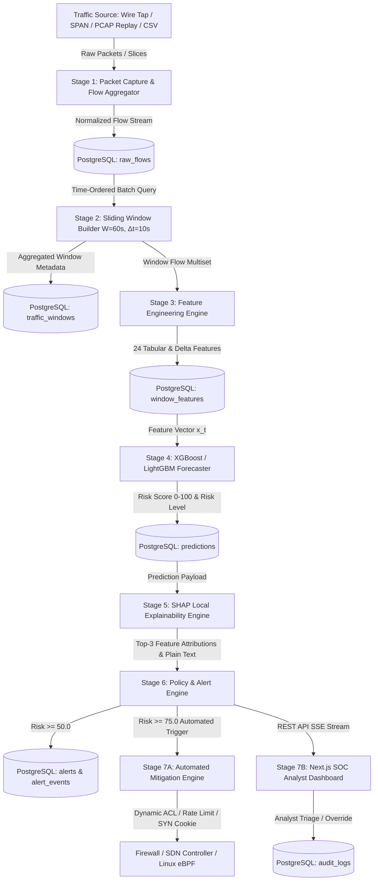

# AI-Based Network Attack Forecasting: Mathematical Formulation, Precursor Dynamics & Architecture Specification

**Document Identifier:** DOC-R1-FORECAST-2026  
**Problem Statement:** SIH26153 (National Technical Research Organisation - NTRO)  
**System Title:** Cogitate AI — Proactive Cyber Attack Early-Warning & Forecasting Engine  
**Author:** Yash Bhanushali (AI/ML Lead) & Team Cogitate  
**Target Milestone:** Milestone 1 — Deliverable R1 (`docs/research/forecasting_formulation.md`)  
**Mathematical Classification:** Applied Probability, Information Theory, Measure Theory & Dynamical Systems  
**Status:** Frozen & Approved for Pipeline Ingestion (Day 1)  

---

## Executive Summary & Abstract

Traditional Network Intrusion Detection Systems (NIDS) operate under a **reactive paradigm** ($X_t \to Y_t$): analyzing traffic payloads and volumetric rates concurrently with packet arrival to classify ongoing malicious activity. Consequently, alerts are emitted *concurrently with* or *subsequent to* target compromise, packet saturation, or service disruption ($\Delta T_{\text{lead}} \le 0\text{s}$). In high-velocity environments, reactive detection leaves zero operational headroom for automated defense orchestration, forcing Security Operations Center (SOC) personnel into protracted post-incident disaster recovery ($\text{MTTR} > 30\text{ minutes}$) while confronting severe alert fatigue ($> 10^4\text{ unranked alerts/day}$).

This research document establishes the formal mathematical and algorithmic foundations of **Proactive Network Attack Forecasting** ($X_t \to Y_{t+1}$). By leveraging non-stationary temporal difference dynamics, information-theoretic entropy dispersion, and multi-stage cyber kill-chain progression ($S_0 \to S_1 \to S_2 \to S_3$), our framework maps retrospective flow observations over rolling window $W(t) = [t - W_{\text{size}}, t]$ to the probability of attack onset and escalation across prospective horizon $\mathcal{H}(t) = (t, t + H_{\text{horizon}}]$, where $H_{\text{horizon}} \in [60\text{s}, 300\text{s}]$. 

We provide:
1. Formal measure-theoretic proofs establishing the **Zero-Lookahead Filtration Invariant** ($\mathbf{x}_t \in m\mathfrak{F}_t$) and the **Temporal Split Embargo Condition** ($\Delta_{\text{purge}} \ge W_{\text{size}} + H_{\text{horizon}}$), guaranteeing zero data leakage.
2. A 4-stage Markovian attack progression model integrated with the MITRE ATT&CK Enterprise Matrix (Tactics `TA0043`, `TA0007`, `TA0042`, `TA0001`, `TA0006`, `TA0040`).
3. Exact dynamical equations for precursor features: Volumetric Momentum ($M_{\text{vol}}$), Normalized Shannon Entropy ($\tilde{H}$), TCP Handshake Asymmetry ($R_{\text{SYN/ACK}}$), Failed Connection Ratio ($\rho_{\text{fail}}$), Short Flow Ratio ($\rho_{\text{short}}$), Velocity ($\Delta f_t$), Acceleration ($\Delta^2 f_t$), and Dual EMA Oscillators.
4. Loss function formulations designed for extreme precursor rarity ($< 1\%$ positive windows), including Weighted Cross-Entropy ($\mathcal{L}_{\text{WCE}}$), Lin et al. Focal Loss ($\mathcal{L}_{\text{Focal}}$), and an Asymmetric Cost-Sensitive Lead-Time Loss ($\mathcal{L}_{\text{Cost-Lead}}$).
5. Actionable SOC evaluation metrics: Mean Lead Time (MLT), Effective Warning Coverage Rate ($\text{EWCR}_\tau$), Alert Usefulness Rate (AUR), and False Warning Rate (FWR/hr).
6. A 7-stage end-to-end dataflow pipeline guaranteeing $< 100\text{ms}$ inference latency and direct automated mitigation linkage.

---

## 1. Problem Paradigm: Reactive IDS vs. Proactive Forecasting

### 1.1 The Operational Crisis in Reactive Intrusion Detection
Modern enterprise perimeters and critical infrastructure face multi-vector cyber campaigns characterized by automated reconnaissance, credential brute-forcing, and multi-gigabit distributed denial-of-service (DDoS) attacks. Standard intrusion detection mechanisms (e.g., Snort, Suricata, Zeek, or classical anomaly detectors) classify instantaneous feature vectors:

$$f_{\text{reactive}}: \mathbf{x}_t \mapsto \hat{y}_t \in \{0, 1\}$$

where $\mathbf{x}_t$ represents packet header flags or flow statistics evaluated at the exact instant $t$ when attack traffic arrives. This formulation suffers from four fatal structural defects:
1. **Zero Lead Time ($\Delta T_{\text{lead}} \le 0\text{s}$)**: Alerts trigger only after malicious packets hit network buffers, web servers, or firewalls. Volumetric floods immediately saturate ingress bandwidth, rendering alerts purely descriptive of an active outage.
2. **Alert Fatigue Paradox**: Reactive signature matching emits tens of thousands of isolated alerts per day without contextual trajectory, causing analyst desensitization and missed critical precursors.
3. **Inability to Preempt Multi-Stage Progression**: Sophisticated adversaries conduct reconnaissance (port scans, service probing) minutes prior to deploying exploits. Reactive tools evaluate these scans in isolation as low-severity noise.
4. **Passive Containment**: Incident response is relegated to post-incident forensics, manual IP blacklisting, or emergency host rebooting.

### 1.2 The Proactive Forecasting Paradigm ($X_t \to Y_{t+1}$)
In contrast, Proactive Network Attack Forecasting reframes cyber defense as **stochastic trajectory forecasting**. Recognizing that sophisticated cyber attacks are preceded by measurable preparatory perturbations (precursor dynamics), the objective is to predict whether an attack will initiate or escalate within a future time horizon:

$$f_{\theta}: \mathbf{x}_t = \Phi(\mathcal{F}_{W(t)}) \mapsto \hat{p}_t = \mathbb{P}\left( Y_t^{(H)} = 1 \;\middle|\; \mathfrak{F}_t \right)$$

where:
- $\mathcal{F}_{W(t)}$ is the set of network flows strictly within retrospective observation window $W(t) = [t - W_{\text{size}}, t]$.
- $Y_t^{(H)}$ is the ground-truth supervisory label indicating attack occurrence within prospective forecast horizon $\mathcal{H}(t) = (t, t + H_{\text{horizon}}]$.
- $H_{\text{horizon}} \in [60\text{s}, 300\text{s}]$ unlocks an actionable $1\text{ to }5\text{ minute}$ window for automated, zero-touch mitigation.

```
PAST (Observation Window W(t))              PRESENT (Epoch t)          FUTURE (Forecast Horizon H(t))
[t - W_size ───────────────────────────── t]        │         (t ──────────────────────────── t + H_horizon]
  Precursor Telemetry & Flow Ingestion             │                 Predicted Attack Onset / Peak
  - Stealth Port Scans (H(dst_port) ↑)             │                 - Volumetric DDoS Flood (T1498)
  - Handshake Asymmetry (R_SYN/ACK > 10)           │                 - Endpoint Service Exhaustion (T1499)
  - Connection Churn (ρ_fail ↑, ρ_short ↑)         │                 - High-Rate Credential Brute (T1110)
  - Positive Acceleration (Δ^2 f_t > 0)            │
                     │                             │                                ▲
                     ▼                             ▼                                │
           Feature Extraction Φ               Forward Inference                     │
           x_t ∈ R^24                   ──>   p_t = f_θ(x_t) ≥ θ_alert  ────────────┘
                                                   │
                                                   ▼
                                      EARLY-WARNING LEAD TIME
                                   Δ T_lead = T_onset - t ∈ [60s, 300s]
                                   Automated Firewall / ACL Pre-staging
```

### 1.3 Comprehensive Architectural & Operational Comparison Matrix

| Dimension | Reactive Intrusion Detection (NIDS / Snort / Baseline ML) | Proactive Attack Forecasting (Cogitate Engine) |
| :--- | :--- | :--- |
| **Mathematical Formulation** | $\mathbf{x}_t \mapsto \hat{y}_t$ (Concurrent state classification) | $\mathbf{x}_t \mapsto \hat{Y}_{t+1}^{(H)}$ (Conditional future probability estimation) |
| **Temporal Horizon ($H$)** | $H = 0\text{s}$ (Static instant evaluation) | $H \in [60\text{s}, 300\text{s}]$ ($1\text{ to }5\text{ minutes}$ forward lookahead) |
| **Early-Warning Lead Time** | $\Delta T_{\text{lead}} \le 0\text{s}$ (Alert issued post-detonation) | $\Delta T_{\text{lead}} \in [60\text{s}, 300\text{s}]$ ($\text{Mean Lead Time} > 120\text{s}$) |
| **Input Granularity** | Raw packet payloads, regex signatures, isolated flows | Sliding temporal window aggregates ($W=60\text{s}$) + velocity deltas ($\Delta f_t$) |
| **Precursor Dynamics** | Dismissed as low-priority noise or single-packet scan alert | Core signal: entropy dispersion, TCP asymmetry, short flow ratios |
| **Alert Volume & Quality** | High volume ($>10^4\text{ alerts/day}$), severe alert fatigue | Aggregated window risk scores ($0–100$), high Alert Usefulness Rate ($\text{AUR} \ge 85\%$) |
| **Adversarial Resilience** | Defeated by TLS 1.3 payload encryption, fragmentation | Invariant to payload encryption; models statistical flow kinematics |
| **Explainability** | Static rule ID (e.g., `SID:2001219`) or opaque anomaly scalar | TreeSHAP exact attribution + automated plain-text root cause synthesis |
| **SOC Workflow Impact** | High Mean Time to Respond ($\text{MTTR} > 30\text{ min}$); manual fire-fighting | Pre-incident response; automated ACL rules deployed before service outage |
| **Loss Optimization** | Unweighted Cross-Entropy (collapses on imbalance) | Cost-Sensitive Focal Loss ($\mathcal{L}_{\text{Focal}}$) + Lead-Time Decay ($\mathcal{L}_{\text{Cost-Lead}}$) |
| **Evaluation Metrics** | Misleading Accuracy ($>99\%$ on benign data), ROC-AUC | PR-AUC, Cost-Weighted $F_2$, Mean Lead Time (MLT), $\text{EWCR}_{60\text{s}}$ |
| **Defensive Action** | Post-compromise IP blocking, server rebuilds | Preemptive rate-limiting, SYN cookies, dynamic BGP routing, SDN flow quarantine |

---

## 2. Mathematical Problem Formulation

### 2.1 Network Flow Space & Attribute Tuples
Let the continuous network packet stream be partitioned into an ordered sequence of discrete transport-layer flow records:

$$\mathcal{F} = \{ f_i \}_{i=1}^N$$

Each flow record $f_i$ is a 12-tuple defined over the bounded multi-dimensional attribute space $\Omega_{\mathcal{F}}$:

$$f_i = (\tau_i, s_i, d_i, p_i^s, p_i^d, \pi_i, k_i, b_i, \delta_i, \mathbf{\gamma}_i, c_i, \ell_i) \in \Omega_{\mathcal{F}}$$

The constituent domain spaces are rigorously defined as:
- $\tau_i \in \mathbb{R}^+$: Flow initiation epoch timestamp (in seconds, millisecond precision), satisfying chronological monotonicity: $\tau_1 \le \tau_2 \le \dots \le \tau_N$.
- $s_i \in \mathcal{IP}$: Source IP address, where $\mathcal{IP}_{\text{IPv4}} \subset \mathbb{Z}_{2^{32}}$ and $\mathcal{IP}_{\text{IPv6}} \subset \mathbb{Z}_{2^{128}}$.
- $d_i \in \mathcal{IP}$: Destination IP address.
- $p_i^s \in \mathcal{PORT} = \{0, 1, 2, \dots, 65535\}$: Source transport layer port.
- $p_i^d \in \mathcal{PORT} = \{0, 1, 2, \dots, 65535\}$: Destination transport layer port.
- $\pi_i \in \mathcal{PROTO} = \{\text{TCP (6)}, \text{UDP (17)}, \text{ICMP (1)}, \text{OTHER}\}$: Layer-4 transport protocol identifier.
- $k_i \in \mathbb{N}^+$: Aggregate packet count ($k_i = k_i^{\text{fwd}} + k_i^{\text{bwd}} \ge 1$).
- $b_i \in \mathbb{N}$: Aggregate byte volume ($b_i = b_i^{\text{fwd}} + b_i^{\text{bwd}} \ge 0$).
- $\delta_i \in \mathbb{R}^+$: Active flow duration in milliseconds ($\delta_i \ge 0.0$).
- $\mathbf{\gamma}_i = [\gamma_{\text{SYN}}, \gamma_{\text{ACK}}, \gamma_{\text{FIN}}, \gamma_{\text{RST}}, \gamma_{\text{PSH}}, \gamma_{\text{URG}}]^T \in \{0, 1\}^6$: Binary TCP control flag presence vector.
- $c_i \in \mathcal{C} = \{\text{CLEAN}, \text{SYN\_NO\_ACK}, \text{RST\_ABORT}, \text{ZERO\_WIN}, \text{NA}\}$: Connection health and teardown classification.
- $\ell_i \in \mathcal{L}$: Ground-truth taxonomic label from benchmark or security taxonomy:
  $$\mathcal{L} = \{\text{BENIGN}, \text{PortScan}, \text{DoS\_Hulk}, \text{DoS\_GoldenEye}, \text{DDoS\_LOIC}, \text{FTP\_Patator}, \text{SSH\_Patator}, \dots\}$$

### 2.2 Temporal Discretization & Observation Windows
Let $t \in \mathbb{R}^+$ denote the current observation/inference epoch.

**Definition 1 (Retrospective Observation Window):**  
The retrospective observation window $W(t)$ of duration $W_{\text{size}} > 0$ is defined as the closed temporal interval:

$$W(t) = [t - W_{\text{size}}, t]$$

The multiset of network flows initiated within observation window $W(t)$ is:

$$\mathcal{F}_{W(t)} = \{ f_i \in \mathcal{F} \mid \tau_i \in [t - W_{\text{size}}, t] \}$$

with window flow cardinality $N(t) = |\mathcal{F}_{W(t)}|$.

**Definition 2 (Sliding Step & Temporal Discretization):**  
The temporal evolution of the continuous flow stream is sampled at discrete evaluation epochs parameterized by sliding stride $\Delta t \in (0, W_{\text{size}}]$:

$$t_m = t_0 + m \cdot \Delta t, \quad m \in \{0, 1, 2, \dots, M\}$$

The window overlap coefficient $\eta \in [0, 1)$ is:

$$\eta = 1 - \frac{\Delta t}{W_{\text{size}}}$$

*Operational Configurations:*
- **Micro-Burst Telemetry**: $W_{\text{size}} = 10\text{s}, \Delta t = 1\text{s} \implies \eta = 0.900$ (High temporal resolution for fast floods).
- **Standard Early-Warning**: $W_{\text{size}} = 30\text{s}, \Delta t = 5\text{s} \implies \eta = 0.833$ (Balanced operational baseline).
- **Macro-Trend Early-Warning**: $W_{\text{size}} = 60\text{s}, \Delta t = 10\text{s} \implies \eta = 0.833$ (Primary SIH26153 production configuration).

### 2.3 Feature Aggregation Functional $\Phi$
The feature engineering subsystem is formalized as a deterministic mapping functional $\Phi: \mathcal{P}(\Omega_{\mathcal{F}}) \times \mathbb{R}^{D} \to \mathbb{R}^D$:

$$\mathbf{x}_t = \Phi(\mathcal{F}_{W(t)}, \mathbf{x}_{t-1}) = \begin{bmatrix} \phi_1(\mathcal{F}_{W(t)}) \\ \phi_2(\mathcal{F}_{W(t)}) \\ \vdots \\ \phi_D(\mathcal{F}_{W(t)}, \mathbf{x}_{t-1}) \end{bmatrix} \in \mathbb{R}^D$$

where $D = 24$ captures statistical moments, entropy distributions, protocol ratios, and temporal delta kinematics.

### 2.4 Prospective Forecasting Horizon & Shifted Target Labeling
Let $H_{\text{horizon}} > 0$ denote the forward prediction horizon ($H_{\text{horizon}} \in [60\text{s}, 300\text{s}]$), and let $\delta_{\text{gap}} \ge 0$ denote an optional mitigation lead buffer.

**Definition 3 (Prospective Forecast Horizon):**  
The prospective forecast horizon $\mathcal{H}(t)$ is the half-open future interval:

$$\mathcal{H}(t) = (t + \delta_{\text{gap}}, t + \delta_{\text{gap}} + H_{\text{horizon}}]$$

Under standard continuous zero-gap monitoring ($\delta_{\text{gap}} = 0$), $\mathcal{H}(t) = (t, t + H_{\text{horizon}}]$.

**Definition 4 (Shifted Binary Target Label $Y_t$):**  
Let $\mathcal{A} \subset \mathcal{L} \setminus \{\text{BENIGN}\}$ denote the subset of malicious attack classes. The binary supervisory target label $Y_t \in \{0, 1\}$ associated with observation feature vector $\mathbf{x}_t$ is defined by the predicate indicator:

$$Y_t = \mathbb{I}\left( \exists f_j \in \mathcal{F} \;\text{s.t.}\; \tau_j \in \mathcal{H}(t) \land \ell_j \in \mathcal{A} \right)$$

where $\mathbb{I}(P) = 1$ if predicate $P$ is true, and $0$ otherwise.

**Definition 5 (Multi-Stage Target Label $Y_t^{\text{stage}}$):**  
To capture the granular kill-chain escalation level:

$$Y_t^{\text{stage}} = \max \left\{ \text{Severity}(\ell_j) \;\middle|\; f_j \in \mathcal{F}, \tau_j \in \mathcal{H}(t) \right\} \in \{0, 1, 2, 3\}$$

where $\text{Severity}(\text{BENIGN}) = 0$, $\text{Severity}(\text{PortScan}) = 1$, $\text{Severity}(\text{Patator/BruteForce}) = 2$, and $\text{Severity}(\text{DoS/DDoS}) = 3$.

---

## 3. Measure-Theoretic Anti-Leakage Proofs & Invariants

Data leakage across temporal horizons is the primary cause of inflated offline benchmark performance and catastrophic online failure in time-series security ML. We formalize the filtration algebra governing flow arrivals and mathematically prove zero lookahead and split isolation.

```
       TRAINING SPLIT T_train                     EMBARGO PURGE BUFFER Δ_purge                  EVALUATION SPLIT T_test
[0 ───────────────────────── t_train^max]       [t_train^max ────────────── T_split + Δ_purge] [T_split + Δ_purge ──────────── T_max]
     Observation W(t)       Target H(t)                       Δ_purge ≥ W_size + H_horizon           Observation W(t')    Target H(t')
   [t-W_size ─── t]     (t ─── t+H_horizon]                         MUTUALLY DISJOINT               [t'-W_size ─── t']  (t' ─── t'+H_horizon]
         │                     │                                   NO OVERLAP POSSIBLE                      │                   │
         └─────────────────────┴────────────────────────────────────────────────────────────────────┴───────────────────┘
                                   SUPREMUM(τ_train) ≤ T_split < INFIMUM(τ_test)
```

### 3.1 Filtration & Historical Information Algebra
Let $(\Omega, \Sigma, \mathbb{P})$ be the fundamental probability space underlying all network flow events.

**Definition 6 (Historical Information Filtration):**  
We define the historical network information filtration $\mathbb{F} = \{ \mathfrak{F}_t \}_{t \ge 0}$ as the continuous, non-decreasing family of sub-$\sigma$-algebras:

$$\mathfrak{F}_t = \sigma\left( \left\{ f_i = (\tau_i, s_i, d_i, p_i^s, p_i^d, \pi_i, k_i, b_i, \delta_i, \mathbf{\gamma}_i, c_i) \in \mathcal{F} \;\middle|\; \tau_i \le t \right\} \right)$$

By construction, $\mathbb{F}$ satisfies the standard causal conditions:
1. $\mathfrak{F}_s \subseteq \mathfrak{F}_t \subseteq \Sigma \quad \forall 0 \le s \le t$.
2. $\mathfrak{F}_t = \bigcap_{u > t} \mathfrak{F}_u$ (Right-continuity).

### 3.2 Theorem 1: Zero-Lookahead Invariant (Causal Measurability)

**Theorem 1 (Zero-Lookahead Feature Invariant):**  
Let $\mathbf{x}_t = \Phi(\mathcal{F}_{W(t)}, \mathbf{x}_{t-1})$ be the feature vector generated from retrospective observation window $W(t) = [t - W_{\text{size}}, t]$.  
Then $\mathbf{x}_t$ is strictly $\mathfrak{F}_t$-measurable ($\mathbf{x}_t \in m\mathfrak{F}_t$), and conditionally independent of all future flow arrivals $\mathcal{F}_{>t} = \{ f_j \in \mathcal{F} \mid \tau_j > t \}$ given $\mathfrak{F}_t$:

$$\mathbb{P}(\mathbf{x}_t \mid \mathfrak{F}_t, \mathcal{F}_{>t}) = \mathbb{P}(\mathbf{x}_t \mid \mathfrak{F}_t)$$

**Proof:**
1. Let $f_i \in \mathcal{F}_{W(t)}$ be an arbitrary flow record in the window multiset. By Definition 1:
   $$\tau_i \in [t - W_{\text{size}}, t] \implies \tau_i \le t$$
   Therefore, the set inclusion holds: $\mathcal{F}_{W(t)} \subseteq \{ f_i \in \mathcal{F} \mid \tau_i \le t \}$.
2. Every elementary coordinate of $f_i$ (packet count $k_i$, byte sum $b_i$, flags $\mathbf{\gamma}_i$, connection state $c_i$, addressing $s_i, d_i, p_i^s, p_i^d$) is a generating random variable of the $\sigma$-algebra $\mathfrak{F}_t$.
3. The functional $\Phi = [\phi_1, \dots, \phi_D]^T$ is a composition of finite summations, quotients with non-zero regularizers ($\epsilon > 0$), discrete difference operators, and continuous Shannon entropy functionals $H(P) = -\sum p \log_2 p$. Each component is a continuous or piecewise continuous mapping from $\mathbb{R}^k \to \mathbb{R}$.
4. By the Lusin-Borel measurability theorem, continuous and piecewise continuous compositions of $\mathfrak{F}_t$-measurable random variables are strictly $\mathfrak{F}_t$-measurable. Thus, $\phi_k(\mathcal{F}_{W(t)}) \in m\mathfrak{F}_t$ for all $k \in \{1, \dots, D\}$.
5. It follows that the joint vector $\mathbf{x}_t \in m\mathfrak{F}_t$.
6. Because $\mathbf{x}_t$ is $\mathfrak{F}_t$-measurable, its generated $\sigma$-algebra satisfies $\sigma(\mathbf{x}_t) \subseteq \mathfrak{F}_t$. By the definition of conditional expectation and conditional independence on $\sigma$-algebras:
   $$\mathbb{E}\left[ g(\mathbf{x}_t) \;\middle|\; \mathfrak{F}_t \vee \sigma(\mathcal{F}_{>t}) \right] = g(\mathbf{x}_t) = \mathbb{E}\left[ g(\mathbf{x}_t) \;\middle|\; \mathfrak{F}_t \right]$$
   for every bounded Borel function $g$. Hence, $\mathbf{x}_t \perp \mathcal{F}_{>t} \mid \mathfrak{F}_t$. $\blacksquare$

### 3.3 Theorem 2: Temporal Split Isolation & Embargo Buffer Guarantee

**Theorem 2 (Cross-Window Contamination & Split Embargo Buffer):**  
Let the total experimental flow stream $\mathcal{F}$ be partitioned chronologically into a training domain $\mathcal{T}_{\text{train}} = [0, T_{\text{split}}]$ and an evaluation/test domain $\mathcal{T}_{\text{test}} = [T_{\text{split}} + \Delta_{\text{purge}}, T_{\text{max}}]$.  
To mathematically guarantee zero mutual information leakage between training supervisory labels $\{Y_t\}_{t \le t_{\text{train}}^{\text{max}}}$ and evaluation feature vectors $\{\mathbf{x}_{t'}\}_{t' \ge t_{\text{test}}^{\text{min}}}$, the temporal purge buffer $\Delta_{\text{purge}}$ and maximum training epoch $t_{\text{train}}^{\text{max}}$ must satisfy:

$$t_{\text{train}}^{\text{max}} \le T_{\text{split}} - H_{\text{horizon}}$$
$$\Delta_{\text{purge}} \ge W_{\text{size}} + H_{\text{horizon}}$$

**Proof:**
1. Consider an arbitrary training observation epoch $t \le t_{\text{train}}^{\text{max}}$. The associated supervisory label $Y_t$ is computed over prospective horizon $\mathcal{H}(t) = (t, t + H_{\text{horizon}}]$.
2. The supremum timestamp of all flow records queried during training label generation is:
   $$\tau_{\text{train}}^{\text{sup}} = \sup_{t \le t_{\text{train}}^{\text{max}}} \sup_{f \in \mathcal{F}_{\mathcal{H}(t)}} \tau(f) = t_{\text{train}}^{\text{max}} + H_{\text{horizon}} \le (T_{\text{split}} - H_{\text{horizon}}) + H_{\text{horizon}} = T_{\text{split}}$$
   Thus, no training instance depends upon flows initiating at epoch $\tau > T_{\text{split}}$.
3. Now consider an arbitrary evaluation instance evaluated at epoch $t' \ge t_{\text{test}}^{\text{min}} = T_{\text{split}} + \Delta_{\text{purge}}$. Its feature vector $\mathbf{x}_{t'}$ is extracted over retrospective window $W(t') = [t' - W_{\text{size}}, t']$.
4. The infimum timestamp of all flow records queried during evaluation feature extraction is:
   $$\tau_{\text{test}}^{\text{inf}} = \inf_{t' \ge T_{\text{split}} + \Delta_{\text{purge}}} \inf_{f \in \mathcal{F}_{W(t')}} \tau(f) = T_{\text{split}} + \Delta_{\text{purge}} - W_{\text{size}}$$
5. Enforcing $\Delta_{\text{purge}} \ge W_{\text{size}} + H_{\text{horizon}}$ guarantees:
   $$\tau_{\text{test}}^{\text{inf}} \ge T_{\text{split}} + (W_{\text{size}} + H_{\text{horizon}}) - W_{\text{size}} = T_{\text{split}} + H_{\text{horizon}} > T_{\text{split}} \ge \tau_{\text{train}}^{\text{sup}}$$
6. Consequently:
   $$\left( \bigcup_{t \le t_{\text{train}}^{\text{max}}} \mathcal{H}(t) \right) \bigcap \left( \bigcup_{t' \ge t_{\text{test}}^{\text{min}}} W(t') \right) = \emptyset$$
   The set of flow records utilized to supervise training and the set of flow records utilized to evaluate model forecasting are strictly disjoint sets in $\mathbb{R}^+$, ensuring zero cross-window lookahead or feature contamination. $\blacksquare$

---

## 4. Attack Progression Lifecycle & MITRE ATT&CK Mapping

Network attacks are not instantaneous point anomalies; they evolve along a continuous state-space kill chain. We model the adversarial progression through a 4-stage discrete stochastic lifecycle $S_t \in \{S_0, S_1, S_2, S_3\}$.

```
┌─────────────────────────────────────────┐           Probing Event Detected           ┌─────────────────────────────────────────┐
│        Stage S_0: Benign Baseline       │ ─────────────────────────────────────────> │   Stage S_1: Reconnaissance / Probing   │
│ - Stationary flow arrival rate          │                                            │ - Destination port entropy H(dst_p) ↑   │
│ - Balanced SYN/ACK ratio (~1.0)         │ <───────────────────────────────────────── │ - Ephemeral flow dominance (ρ_short → 1)│
│ - Failed connection ratio ρ_fail < 0.05 │             Probe Inactivity / Drop        │ - Asymmetric SYN spikes, R_t ∈ [0.2,0.5)│
│ - Risk Score: R_t ∈ [0.00, 0.20)        │                                            └─────────────────────────────────────────┘
└─────────────────────────────────────────┘                                                                 │
                     │                                                                                      │ Exploit Staging / Weaponization
                     │ Direct Sudden Flood (Rare)                                                           ▼
                     │                                                                 ┌─────────────────────────────────────────┐
                     │                                                                 │   Stage S_2: Weaponization & Staging    │
                     │                                                                 │ - Concentrated brute force (T1110)      │
                     │                                                                 │ - Repetitive auth teardowns (RST churn) │
                     │                                                                 │ - Positive Acceleration: Δ^2 f_t > 0    │
                     │                                                                 │ - Risk Score: R_t ∈ [0.50, 0.75)        │
                     ▼                                                                 └─────────────────────────────────────────┘
┌─────────────────────────────────────────┐            Volumetric Saturation Trigger                        │
│      Stage S_3: Active Malicious Peak   │ <───────────────────────────────────────────────────────────────┘
│ - Ingress bandwidth / packet saturation │
│ - Packet rate R_pkt >> μ + 3σ           │
│ - Dropped sessions, TCP ZeroWindow      │
│ - Risk Score: R_t ∈ [0.75, 1.00]        │
└─────────────────────────────────────────┘
```

### 4.1 Four-Stage Attack Progression Specification

#### 1. Stage $S_0$: Normal Benign Baseline ($\mathcal{R}_t \in [0.0, 0.20)$)
- **Stochastic Behavior**: Stationary Markov-Modulated Poisson Process (MMPP) flow arrivals.
- **Handshake Equilibrium**: Completed 3-way handshakes with symmetric SYN and ACK packets ($N_{\text{SYN}} \approx N_{\text{ACK}}$, $R_{\text{SYN/ACK}} \in [0.90, 1.15]$).
- **Error Bounds**: Failed connection ratio $\rho_{\text{fail}} < 0.05$.
- **Port Geometry**: Traffic concentrated on standard enterprise ports (80, 443, 53, 22), yielding low, stable destination port entropy $H(dst\_port) \le 1.8\text{ bits}$.

#### 2. Stage $S_1$: Reconnaissance & Precursor Probing ($\mathcal{R}_t \in [0.20, 0.50)$)
- **MITRE ATT&CK Tactics**: Reconnaissance (`TA0043`), Discovery (`TA0007`).
- **Techniques**: Active Scanning (`T1595.001` IP Sweeps, `T1595.002` Vulnerability Probes), Network Service Discovery (`T1046`).
- **Observable Telemetry**:
  - Broad horizontal/vertical port sweeps causing destination port entropy spikes ($H(dst\_port) \to \log_2(M)$).
  - TCP handshake asymmetry: $N_{\text{SYN}} \gg N_{\text{ACK}}$, with closed ports returning immediate `RST` or silent timeouts.
  - Ephemeral flow collapse: Flow durations $d_i < 10\text{ms}$, driving $\rho_{\text{short}} \to 1.0$.

#### 3. Stage $S_2$: Weaponization, Staging & Escalation ($\mathcal{R}_t \in [0.50, 0.75)$)
- **MITRE ATT&CK Tactics**: Resource Development (`TA0042`), Initial Access (`TA0001`), Credential Access (`TA0006`).
- **Techniques**: Brute Force (`T1110.001` Password Guessing, `T1110.003` Password Spraying).
- **Observable Telemetry**:
  - Flow concentration targeting identified open ports (e.g., SSH 22, FTP 21, RDP 3389, Web API 8080).
  - High authentication churn: rapid consecutive TCP connections established and immediately reset upon auth failure ($N_{\text{RST}} \uparrow$).
  - Botnet C2 rendezvous and staging: low-jitter beaconing flows.
  - Positive kinematics: Second-order flow acceleration $\Delta^2 N(t) > 0$.

#### 4. Stage $S_3$: Active Malicious Payload / Volumetric Peak ($\mathcal{R}_t \in [0.75, 1.00]$)
- **MITRE ATT&CK Tactics**: Impact (`TA0040`).
- **Techniques**: Network Denial of Service (`T1498.001` Direct Flood, `T1498.002` Reflection Amplification), Endpoint DoS (`T1499.001` OS Resource Exhaustion, `T1499.002` Service Exhaustion).
- **Observable Telemetry**:
  - Volumetric saturation: Packet rate $R_{\text{pkt}}(t) \gg \mu_{\text{baseline}} + 3\sigma_{\text{baseline}}$.
  - Buffer exhaustion, packet loss, TCP ZeroWindow advertisements, and complete loss of server responsiveness.

### 4.2 Non-Stationary Markov Transition Model & Composite Risk Score
The inter-stage transition probabilities are parameterized by the current window feature vector $\mathbf{x}_t$:

$$\mathbf{T}(\mathbf{x}_t) = \begin{pmatrix}
1 - p_{01}(\mathbf{x}_t) & p_{01}(\mathbf{x}_t) & 0 & 0 \\
p_{10}(\mathbf{x}_t) & 1 - (p_{10}(\mathbf{x}_t) + p_{12}(\mathbf{x}_t)) & p_{12}(\mathbf{x}_t) & 0 \\
p_{20}(\mathbf{x}_t) & 0 & 1 - (p_{20}(\mathbf{x}_t) + p_{23}(\mathbf{x}_t)) & p_{23}(\mathbf{x}_t) \\
p_{30}(\mathbf{x}_t) & 0 & 0 & 1 - p_{30}(\mathbf{x}_t)
\end{pmatrix}$$

where each forward transition probability is governed by a logistic sigmoid link over learned weights:

$$p_{01}(\mathbf{x}_t) = \sigma(\mathbf{w}_{01}^T \mathbf{x}_t + b_{01}), \quad p_{12}(\mathbf{x}_t) = \sigma(\mathbf{w}_{12}^T \mathbf{x}_t + b_{12}), \quad p_{23}(\mathbf{x}_t) = \sigma(\mathbf{w}_{23}^T \mathbf{x}_t + b_{23})$$

The scalar Risk Score $\mathcal{R}_t \in [0.0, 100.0]$ is defined as the expected normalized severity across the forecast horizon:

$$\mathcal{R}_t = 100 \times \sum_{k=0}^3 v_k \cdot \mathbb{P}(S_{t+H} = S_k \mid \mathbf{x}_t), \quad \text{where } \mathbf{v} = [0.00, 0.33, 0.67, 1.00]^T$$

### 4.3 MITRE ATT&CK Enterprise Matrix Precursor Mapping

| MITRE ID | Tactic & Technique | Lifecycle Phase | Network Telemetry Manifestation | Primary Precursor Features | Benchmark Dataset Classes |
| :--- | :--- | :--- | :--- | :--- | :--- |
| **`T1595.001`** | **Active Scanning: IP Blocks** | $S_0 \to S_1$ (Recon) | Sequential SYN/ICMP sweeps targeting subnet IP range | $H(src\_ip) \approx 0$, $H(dst\_ip) \uparrow$, $\rho_{\text{short}} \to 1.0$, $R_{\text{SYN/ACK}} \gg 1.0$ | `PortScan`, `Infiltration` |
| **`T1595.002`** | **Active Scanning: Vuln Scans** | $S_1$ (Recon) | Malformed HTTP headers, repeated TLS ClientHellos | $\rho_{\text{fail}} \uparrow$, short durations $d_i < 50\text{ms}$, $\Delta N_{\text{flows}} > 0$ | `Web Attack - XSS / SQLi` |
| **`T1046`** | **Network Service Discovery** | $S_1$ (Recon) | Vertical port scanning across destination ports 1–65535 | $H(dst\_port) \gg 0$, $\Delta |\mathcal{P}_{dst}| \gg 0$, $N_{\text{RST}} \gg N_{\text{ACK}}$, $\rho_{\text{short}} \to 1.0$ | `PortScan`, `Botnet ARES` |
| **`T1110.001`** | **Brute Force: Password Guessing** | $S_2$ (Weaponization) | High-frequency connection churn against SSH (22), FTP (21) | $H(dst\_port) \approx 0$, $\text{retry\_rate} \uparrow$, $N_{\text{RST}} \uparrow$, $\Delta^2 N > 0$, low $d_i$ | `FTP-Patator`, `SSH-Patator` |
| **`T1110.003`** | **Brute Force: Password Spraying** | $S_2$ (Weaponization) | Low-and-slow authentication attempts across multiple users | $H(dst\_ip) \uparrow$, $H(dst\_port) \approx 0$, periodic delta patterns, elevated failed logins | `Web Attack - Brute Force` |
| **`T1498.001`** | **Network DoS: Direct Flood** | $S_2 \to S_3$ (Active Peak) | High-volume SYN flood, UDP flood, or ICMP ping flood | $M_{\text{vol}} \gg 5.0$, $R_{\text{SYN/ACK}} > 50$, $\Delta^2 pkts \gg 0$, bandwidth saturation | `DDoS LOIC`, `DoS Hulk` |
| **`T1498.002`** | **Network DoS: Reflection Flood** | $S_3$ (Active Peak) | Amplified UDP responses from DNS (53), NTP (123), SNMP (161) | $R_{\text{in/out}} \ll 0.1$, $H(src\_port) \approx 0$, UDP ratio $\to 1.0$, $M_{\text{vol}} \gg 10.0$ | `DDoS LOIC (UDP)`, `DrDoS` |
| **`T1499.002`** | **Endpoint DoS: Service Exhaustion**| $S_2 \to S_3$ (Active Peak) | Slowloris partial headers, Slow HTTP POST, Hulk floods | Long flow duration $d_i > 10\text{s}$, $N_{\text{active}} \uparrow$, $\Delta N_{\text{req}} \gg 0$, zero RST | `DoS Slowloris`, `DoS Slowhttptest` |

---

## 5. Precursor Feature Mathematics

For retrospective observation window $W(t) = [t - W_{\text{size}}, t]$ with flow set $\mathcal{F}_{W(t)}$ and cardinality $N(t) = |\mathcal{F}_{W(t)}|$, we define the exact mathematical expressions for the 24-dimensional feature vector $\mathbf{x}_t$.

### 5.1 Volumetric Momentum & Burst Kinematics
To distinguish between stationary background traffic and explosive attack ramps, we compute multi-scale historical moving average baselines over $K \ge 3$ preceding non-overlapping windows (e.g., $K=3 \times 60\text{s} = 180\text{s}$ historical baseline):

$$\bar{pkts}_{t-K:t-1} = \frac{1}{K} \sum_{k=1}^K pkts(W(t - k \cdot W_{\text{size}}))$$

1. **Volumetric Momentum ($M_{\text{vol}}$)**:
   $$M_{\text{vol}}(t) = \frac{pkts(W(t))}{\bar{pkts}_{t-K:t-1} + \epsilon_{\text{pkt}}}$$
   where $\epsilon_{\text{pkt}} = 1.0$ guarantees numeric stability in zero-traffic intervals.

2. **Logarithmic Volumetric Momentum ($\tilde{M}_{\text{vol}}$)**:
   $$\tilde{M}_{\text{vol}}(t) = \ln \left( \frac{pkts(W(t)) + \epsilon_{\text{pkt}}}{\bar{pkts}_{t-K:t-1} + \epsilon_{\text{pkt}}} \right)$$

3. **Byte Volumetric Momentum ($M_{\text{byte}}$)**:
   $$M_{\text{byte}}(t) = \frac{bytes(W(t))}{\frac{1}{K}\sum_{k=1}^K bytes(W(t - k \cdot W_{\text{size}})) + \epsilon_{\text{byte}}}$$

4. **Statistical Burst Z-Score ($Z_{\text{burst}}$)**:
   $$Z_{\text{burst}}(t) = \frac{pkts(W(t)) - \mu_{\text{pkts}}(t-K:t-1)}{\sigma_{\text{pkts}}(t-K:t-1) + \epsilon_{\sigma}}$$
   where $\sigma_{\text{pkts}} = \sqrt{\frac{1}{K} \sum_{k=1}^K (pkts_k - \mu)^2}$ and $\epsilon_{\sigma} = 1e-3$.

### 5.2 Information-Theoretic Entropy of Network Addressing
Shannon Information Entropy quantifies the uncertainty and dispersion across network coordinates, acting as an invariant discriminator between targeted attacks and broad reconnaissance sweeps.

1. **Destination Port Shannon Entropy ($H(dst\_port)$)**:
   Let $\mathcal{P}_{dst}(t) = \{p_1, p_2, \dots, p_M\}$ denote the set of unique destination ports in $W(t)$. The empirical probability mass of port $p_m$ is:
   $$P(dst\_port = p_m) = \frac{1}{N(t)} \sum_{f_i \in \mathcal{F}_{W(t)}} \mathbb{I}(p_i^d = p_m)$$
   The raw Shannon Entropy (in bits) is:
   $$H(dst\_port) = -\sum_{m=1}^M P(dst\_port = p_m) \log_2 P(dst\_port = p_m)$$
   **Normalized Destination Port Entropy ($\tilde{H}(dst\_port) \in [0.0, 1.0]$)**:
   $$\tilde{H}(dst\_port) = \begin{cases} \frac{H(dst\_port)}{\log_2(\min(N(t), 65536))} & \text{if } N(t) > 1 \\ 0.0 & \text{if } N(t) \le 1 \end{cases}$$
   - *Invariant Property*: If traffic targets a single port (e.g., Web port 443), $H(dst\_port) = 0$. If an adversary scans $M$ distinct ports uniformly, $H(dst\_port) = \log_2(M) \gg 0$.

2. **Source IP Shannon Entropy ($H(src\_ip)$)**:
   Let $\mathcal{U}_{src}(t) = \{u_1, u_2, \dots, u_U\}$ denote unique source IP addresses in $W(t)$. The empirical probability is $P(src\_ip = u_j) = \frac{1}{N(t)}\sum_{f_i} \mathbb{I}(s_i = u_j)$.
   $$H(src\_ip) = -\sum_{j=1}^U P(src\_ip = u_j) \log_2 P(src\_ip = u_j)$$
   **Normalized Source IP Entropy ($\tilde{H}(src\_ip) \in [0.0, 1.0]$)**:
   $$\tilde{H}(src\_ip) = \begin{cases} \frac{H(src\_ip)}{\log_2(N(t))} & \text{if } N(t) > 1 \\ 0.0 & \text{if } N(t) \le 1 \end{cases}$$
   - *Invariant Property*: In single-source brute force or port scans, $\tilde{H}(src\_ip) \to 0$. In distributed multi-botnet DDoS floods, $\tilde{H}(src\_ip) \to 1.0$.

### 5.3 TCP Handshake Asymmetry & Connection Health Ratios

1. **TCP Handshake Asymmetry Ratio ($R_{\text{SYN/ACK}}$)**:
   Let $N_{\text{SYN}}(t) = \sum_{f_i \in \mathcal{F}_{W(t)}} \mathbb{I}(\gamma_{\text{SYN}} = 1)$ and $N_{\text{ACK}}(t) = \sum_{f_i \in \mathcal{F}_{W(t)}} \mathbb{I}(\gamma_{\text{ACK}} = 1)$.
   $$R_{\text{SYN/ACK}}(t) = \frac{N_{\text{SYN}}(t)}{N_{\text{ACK}}(t) + \epsilon_{\text{flag}}}, \quad \epsilon_{\text{flag}} = 1.0$$
   - In benign sessions, 3-way handshakes enforce $R_{\text{SYN/ACK}} \approx 1.0$. In SYN flood / SYN scan attacks, $R_{\text{SYN/ACK}} > 50.0$.

2. **Normalized TCP Flag Vector ($\mathbf{r}_{\text{flags}} \in [0.0, 1.0]^6$)**:
   $$\mathbf{r}_{\text{flags}}(t) = \left[ \frac{N_{\text{SYN}}(t)}{N(t) + \epsilon}, \frac{N_{\text{ACK}}(t)}{N(t) + \epsilon}, \frac{N_{\text{FIN}}(t)}{N(t) + \epsilon}, \frac{N_{\text{RST}}(t)}{N(t) + \epsilon}, \frac{N_{\text{PSH}}(t)}{N(t) + \epsilon}, \frac{N_{\text{URG}}(t)}{N(t) + \epsilon} \right]^T$$

3. **Failed Connection Ratio ($\rho_{\text{fail}} \in [0.0, 1.0]$)**:
   $$\rho_{\text{fail}}(t) = \frac{1}{N(t) + \epsilon} \sum_{f_i \in \mathcal{F}_{W(t)}} \mathbb{I}(c_i \in \{\text{SYN\_NO\_ACK}, \text{RST\_ABORT}, \text{ZERO\_WIN}\})$$
   - Benign baseline: $\rho_{\text{fail}} < 0.05$. Port scanning / auth brute-force: $\rho_{\text{fail}} > 0.70$.

4. **Short Flow Ratio ($\rho_{\text{short}} \in [0.0, 1.0]$)**:
   $$\rho_{\text{short}}(t) = \frac{1}{N(t) + \epsilon} \sum_{f_i \in \mathcal{F}_{W(t)}} \mathbb{I}(\delta_i < \theta_{\text{duration}}), \quad \theta_{\text{duration}} = 100.0\text{ ms}$$

5. **Inbound-to-Outbound Volume Ratio ($R_{\text{in/out}}$)**:
   $$R_{\text{in/out}}(t) = \frac{\sum_{f_i \in \mathcal{F}_{\text{inbound}}(W(t))} b_i}{\sum_{f_j \in \mathcal{F}_{\text{outbound}}(W(t))} b_j + \epsilon_{\text{byte}}}$$

### 5.4 Temporal Delta Velocity ($\Delta f_t$) & Acceleration ($\Delta^2 f_t$) Kinematics
Network attack escalation is inherently a non-linear dynamical process. Static single-window snapshots miss kinematic acceleration. We define discrete temporal difference operators over the sequence of window states $\{\mathbf{x}_t, \mathbf{x}_{t-1}, \mathbf{x}_{t-2}, \dots\}$:

```
Window t-2                Window t-1                 Window t
[ ────── W ────── ]       [ ────── W ────── ]        [ ────── W ────── ]
        f_{t-2}                   f_{t-1}                    f_t
           │                         │                        │
           └────────────┬────────────┘                        │
                        ▼                                     │
                Δ f_{t-1} = f_{t-1} - f_{t-2}                 │
                        │                                     │
                        │            ┌────────────────────────┘
                        │            ▼
                        │    Δ f_t = f_t - f_{t-1}  (Velocity)
                        │            │
                        └──────┬─────┘
                               ▼
                Δ^2 f_t = Δ f_t - Δ f_{t-1}  (Acceleration)
                        = f_t - 2 f_{t-1} + f_{t-2}
```

1. **First-Order Temporal Velocity ($\Delta f_t$)**:
   $$\Delta f_t = f_t - f_{t-1}$$
   - Flow Rate Velocity: $\Delta N(t) = N(t) - N(t-1)$
   - SYN Rate Velocity: $\Delta N_{\text{SYN}}(t) = N_{\text{SYN}}(t) - N_{\text{SYN}}(t-1)$
   - Destination Port Entropy Velocity: $\Delta H(dst\_port)_t = H(dst\_port)_t - H(dst\_port)_{t-1}$

2. **Second-Order Temporal Acceleration ($\Delta^2 f_t$)**:
   $$\Delta^2 f_t = \Delta(\Delta f_t) = \Delta f_t - \Delta f_{t-1} = f_t - 2 f_{t-1} + f_{t-2}$$
   - *Physical Interpretation*:
     - $\Delta^2 N(t) \approx 0 \land \Delta N(t) > 0$: Linear increase (benign business-hours ramp).
     - $\Delta^2 N(t) \gg 0$: Exponential burst (automated botnet weaponization or flood onset).

3. **Dual Exponential Moving Average (EMA) Momentum Oscillator**:
   $$\text{EMA}_{\text{fast}}(t) = \alpha_{\text{fast}} f_t + (1 - \alpha_{\text{fast}}) \text{EMA}_{\text{fast}}(t-1), \quad \alpha_{\text{fast}} = \frac{2}{3 + 1} = 0.500$$
   $$\text{EMA}_{\text{slow}}(t) = \alpha_{\text{slow}} f_t + (1 - \alpha_{\text{slow}}) \text{EMA}_{\text{slow}}(t-1), \quad \alpha_{\text{slow}} = \frac{2}{10 + 1} \approx 0.1818$$
   $$\text{OSC}_{\text{momentum}}(t) = \text{EMA}_{\text{fast}}(t) - \text{EMA}_{\text{slow}}(t)$$
   - A positive crossover ($\text{OSC}_{\text{momentum}}(t) > 0 \land \Delta \text{OSC} > 0$) provides a robust smoothed trigger for imminent attack escalation.

### 5.5 Complete 24-Dimensional Window Feature Vector ($\mathbf{x}_t \in \mathbb{R}^{24}$)

> **Contract note (v1, 2026-09-02).** The frozen implementation contract in `docs/api/feature_schema_contract.json` carries 37 features: the 24 below plus protocol/flag ratios, per-second rates, and explicit `delta_*` features. `flow_rate_delta` and `flow_rate_accel` are represented in v1 by `delta_packet_rate`, `delta_byte_rate`, and `delta_packet_burst_score`; second-order acceleration is deferred to schema v2. Names in the contract are authoritative for code.

| Index $k$ | Feature Identifier | Formal Mathematical Definition | Domain | Physical Cyber Interpretation |
| :--- | :--- | :--- | :--- | :--- |
| 1 | `flow_count` | $N(t) = |\mathcal{F}_{W(t)}|$ | $\mathbb{Z}_{\ge 0}$ | Total flow intensity in window |
| 2 | `packet_count` | $pkts(t) = \sum_{f_i} k_i$ | $\mathbb{Z}_{\ge 0}$ | Aggregate packet volume |
| 3 | `byte_count` | $bytes(t) = \sum_{f_i} b_i$ | $\mathbb{Z}_{\ge 0}$ | Aggregate byte volume |
| 4 | `packet_rate_per_sec` | $\frac{pkts(t)}{W_{\text{size}}}$ | $\mathbb{R}_{\ge 0}$ | Packet throughput intensity |
| 5 | `byte_rate_per_sec` | $\frac{bytes(t)}{W_{\text{size}}}$ | $\mathbb{R}_{\ge 0}$ | Bandwidth consumption |
| 6 | `avg_packets_per_flow`| $\frac{pkts(t)}{N(t) + \epsilon}$ | $\mathbb{R}_{\ge 0}$ | Average flow packet depth |
| 7 | `avg_bytes_per_flow` | $\frac{bytes(t)}{N(t) + \epsilon}$ | $\mathbb{R}_{\ge 0}$ | Average flow payload size |
| 8 | `avg_duration_ms` | $\frac{1}{N(t) + \epsilon} \sum \delta_i$ | $\mathbb{R}_{\ge 0}$ | Average session persistence |
| 9 | `unique_src_ips` | $|\mathcal{U}_{src}(t)|$ | $\mathbb{Z}_{\ge 0}$ | Source host count |
| 10 | `unique_dst_ips` | $|\mathcal{U}_{dst}(t)|$ | $\mathbb{Z}_{\ge 0}$ | Target host count |
| 11 | `unique_dst_ports` | $|\mathcal{P}_{dst}(t)|$ | $\mathbb{Z}_{\ge 0}$ | Target service spread |
| 12 | `dst_port_entropy` | $-\sum P(p_m) \log_2 P(p_m)$ | $[0.0, 16.0]$ | Service probing dispersion |
| 13 | `src_ip_entropy` | $-\sum P(u_j) \log_2 P(u_j)$ | $[0.0, \infty)$ | Distributed botnet dispersion |
| 14 | `syn_ratio` | $\frac{N_{\text{SYN}}(t)}{N(t) + \epsilon}$ | $[0.0, 1.0]$ | Connection initiation fraction |
| 15 | `ack_ratio` | $\frac{N_{\text{ACK}}(t)}{N(t) + \epsilon}$ | $[0.0, 1.0]$ | Established session fraction |
| 16 | `rst_ratio` | $\frac{N_{\text{RST}}(t)}{N(t) + \epsilon}$ | $[0.0, 1.0]$ | Connection abort fraction |
| 17 | `syn_ack_ratio` | $\frac{N_{\text{SYN}}(t)}{N_{\text{ACK}}(t) + 1.0}$ | $[0.0, \infty)$ | Handshake asymmetry ratio |
| 18 | `failed_conn_ratio` | $\rho_{\text{fail}}(t)$ | $[0.0, 1.0]$ | Failed/rejected connection fraction |
| 19 | `short_flow_ratio` | $\rho_{\text{short}}(t)$ ($<100\text{ms}$) | $[0.0, 1.0]$ | Ephemeral micro-flow fraction |
| 20 | `packet_burst_score`| $\frac{pkts(t)}{\bar{pkts}_{t-3:t-1} + 1.0}$ | $[0.0, \infty)$ | Volumetric momentum |
| 21 | `syn_burst_score` | $\frac{N_{\text{SYN}}(t)}{\bar{N}_{\text{SYN}, t-3:t-1} + 1.0}$ | $[0.0, \infty)$ | Handshake burst momentum |
| 22 | `flow_rate_delta` | $\Delta N(t) = N(t) - N(t-1)$ | $\mathbb{R}$ | First-order flow velocity |
| 23 | `flow_rate_accel` | $\Delta^2 N(t) = N(t) - 2N(t-1) + N(t-2)$ | $\mathbb{R}$ | Second-order flow acceleration |
| 24 | `protocol_tcp_ratio` | $\frac{N_{\text{TCP}}(t)}{N(t) + \epsilon}$ | $[0.0, 1.0]$ | TCP protocol dominance |

---

## 6. Loss Function Formulations for Imbalanced Precursor Forecasting

### 6.1 Class Imbalance in Attack Early Warning
In operational networks, benign traffic represents $> 99\%$ of all temporal windows. Attack precursor transitions are extremely rare:

$$\pi_1 = \mathbb{P}(Y_t = 1) \ll \mathbb{P}(Y_t = 0) = \pi_0, \quad \frac{\pi_0}{\pi_1} \in [10^2, 10^4]$$

Under standard Binary Cross-Entropy $\mathcal{L}_{\text{CE}} = - [y \log p + (1-y)\log(1-p)]$, the expected gradient:

$$\mathbb{E}\left[ \nabla_\theta \mathcal{L}_{\text{CE}} \right] = \pi_0 \mathbb{E}\left[ \nabla_\theta \mathcal{L} \mid Y=0 \right] + \pi_1 \mathbb{E}\left[ \nabla_\theta \mathcal{L} \mid Y=1 \right]$$

is overwhelmingly dominated by trivial negative (benign) instances, driving model weights to degenerate sub-optima where $\hat{p}_t \to 0$ everywhere.

### 6.2 Weighted Cross-Entropy Loss ($\mathcal{L}_{\text{WCE}}$)
To balance gradient contributions across class distributions:

$$\mathcal{L}_{\text{WCE}}(y_i, p_i) = - \left[ w_1 y_i \log(p_i) + w_0 (1 - y_i) \log(1 - p_i) \right]$$

where $p_i = \sigma(z_i) = \frac{1}{1 + e^{-z_i}}$ is the model risk probability for logit $z_i \in \mathbb{R}$. The weights are set via inverse empirical frequency:

$$w_1 = \frac{N_0 + N_1}{2 N_1} = \frac{1}{2 \pi_1}, \quad w_0 = \frac{N_0 + N_1}{2 N_0} = \frac{1}{2 \pi_0}$$

The analytical gradient with respect to logit $z_i$ is:

$$\frac{\partial \mathcal{L}_{\text{WCE}}}{\partial z_i} = \begin{cases} w_1 (p_i - 1) & \text{if } y_i = 1 \\ w_0 p_i & \text{if } y_i = 0 \end{cases}$$

When $y_i = 1$ and $p_i \ll 1$, the gradient magnitude is boosted by factor $w_1 \gg w_0$, forcing aggressive parameter updates on missed precursors.

### 6.3 Lin et al. Focal Loss for Hard Precursor Mining ($\mathcal{L}_{\text{Focal}}$)
While $\mathcal{L}_{\text{WCE}}$ scales all positive instances uniformly, subtle precursor signals require focusing learning capacity on *hard, ambiguous transitions* while suppressing well-classified benign windows.

We formulate Focal Loss for network attack forecasting:

$$\mathcal{L}_{\text{Focal}}(y_i, p_i) = - \alpha_t (1 - p_{t, i})^\gamma \log(p_{t, i})$$

where:

$$p_{t, i} = \begin{cases} p_i & \text{if } y_i = 1 \\ 1 - p_i & \text{if } y_i = 0 \end{cases}, \quad \alpha_t = \begin{cases} \alpha & \text{if } y_i = 1 \\ 1 - \alpha & \text{if } y_i = 0 \end{cases}$$

Expanding into explicit binary terms:

$$\mathcal{L}_{\text{Focal}}(y_i, p_i) = - \alpha y_i (1 - p_i)^\gamma \log(p_i) - (1 - \alpha)(1 - y_i) p_i^\gamma \log(1 - p_i)$$

where:
- $\gamma \ge 0$ is the focusing parameter (recommended $\gamma = 2.0$).
- $\alpha \in (0, 1)$ is the class balance parameter (recommended $\alpha = 0.75$).

**Modulation Dynamics Analysis:**
- **Easy Benign Window** ($y_i = 0, p_i = 0.02$):
  $$\text{Modulating factor } p_i^\gamma = (0.02)^2 = 0.0004 \implies 99.96\% \text{ loss suppression.}$$
- **Hard Precursor Window** ($y_i = 1, p_i = 0.25$):
  $$\text{Modulating factor } (1 - p_i)^\gamma = (0.75)^2 = 0.5625 \implies \text{retains strong gradient signal.}$$

The gradient of $\mathcal{L}_{\text{Focal}}$ with respect to logit $z_i$ is:

$$\frac{\partial \mathcal{L}_{\text{Focal}}}{\partial z_i} = \begin{cases} 
\alpha (1 - p_i)^\gamma \left[ \gamma p_i \log(p_i) + p_i - 1 \right] & \text{if } y_i = 1 \\
(1 - \alpha) p_i^\gamma \left[ p_i - \gamma (1 - p_i) \log(1 - p_i) \right] & \text{if } y_i = 0
\end{cases}$$

### 6.4 Asymmetric Cost-Sensitive Lead-Time Loss ($\mathcal{L}_{\text{Cost-Lead}}$)
Temporal errors in attack forecasting have asymmetric real-world consequences:
1. **False Negatives / Late Warnings** ($t_{\text{alert}} \approx T_{\text{onset}}$ or $t_{\text{alert}} > T_{\text{onset}}$): Zero lead time for defense; server collapse. Critical Cost $C_{\text{FN}}^{\text{late}} \to \infty$.
2. **Premature / False Warnings** ($t_{\text{alert}} \ll T_{\text{onset}} - H_{\text{horizon}}$): SOC analyst triage time. Moderate Cost $C_{\text{FP}} \ll C_{\text{FN}}$.

We formulate the unified Asymmetric Cost-Sensitive Lead-Time Loss:

$$\mathcal{L}_{\text{Cost-Lead}}(y_i, p_i; t_i, T_{\text{onset}}) = \mathcal{L}_{\text{Focal}}(y_i, p_i) \cdot \Psi(y_i, p_i, t_i, T_{\text{onset}})$$

where the temporal penalty multiplier $\Psi$ is:

$$\Psi(y_i, p_i, t_i, T_{\text{onset}}) = \begin{cases}
1 + \lambda_{\text{late}} \cdot \exp\left( - \frac{\max(0, T_{\text{onset}} - t_i)}{\tau_{\text{decay}}} \right) & \text{if } y_i = 1 \land p_i < \theta_{\text{alert}} \\
1 + \lambda_{\text{early}} \cdot \max\left( 0, \frac{(T_{\text{onset}} - t_i) - H_{\text{horizon}}}{H_{\text{horizon}}} \right) & \text{if } y_i = 0 \land p_i \ge \theta_{\text{alert}} \\
1.0 & \text{otherwise}
\end{cases}$$

where:
- $\lambda_{\text{late}} = 5.0$: Severe escalation penalty for unalerted impending attacks as time-to-onset collapses.
- $\tau_{\text{decay}} = 30.0\text{s}$: Exponential temporal decay scale.
- $\lambda_{\text{early}} = 1.0$: Linear penalty for false early triggers.

---

## 7. Lead-Time & Early Warning Evaluation Metrics

Standard accuracy is structurally invalidated by class imbalance. We formalize a comprehensive suite of threshold-dependent, threshold-independent, and temporal lead-time metrics.

### 7.1 Imbalanced Classification Metrics
For decision threshold $\theta \in [0, 1]$ and binary prediction $\hat{y}_t = \mathbb{I}(\hat{p}_t \ge \theta)$:

1. **Forecasting Precision ($\mathcal{P}$)**:
   $$\mathcal{P} = \frac{TP}{TP + FP} = \frac{\sum_t \mathbb{I}(y_t = 1 \land \hat{y}_t = 1)}{\sum_t \mathbb{I}(\hat{y}_t = 1)}$$

2. **Forecasting Recall / Precursor Detection Rate ($\mathcal{R}$)**:
   $$\mathcal{R} = \frac{TP}{TP + FN} = \frac{\sum_t \mathbb{I}(y_t = 1 \land \hat{y}_t = 1)}{\sum_t \mathbb{I}(y_t = 1)}$$

3. **Cost-Weighted $F_2$-Score ($F_2$)**:
   $$F_2 = (1 + 2^2) \frac{\mathcal{P} \cdot \mathcal{R}}{2^2 \mathcal{P} + \mathcal{R}} = \frac{5 \cdot \mathcal{P} \cdot \mathcal{R}}{4 \mathcal{P} + \mathcal{R}}$$
   $F_2$ weights recall twice as heavily as precision, enforcing high attack capture rates while tolerating controlled false alerts.

4. **Precision-Recall Area Under the Curve (PR-AUC)**:
   $$\text{PR-AUC} = \int_0^1 \mathcal{P}(\mathcal{R}) \, d\mathcal{R} = \sum_{k=1}^K \mathcal{P}_k \cdot (\mathcal{R}_k - \mathcal{R}_{k-1})$$
   PR-AUC is the definitive threshold-independent metric under heavy class imbalance.

### 7.2 Lead-Time Metrics & Episode Early-Warning Horizon
Let $\mathcal{E} = \{ E_1, E_2, \dots, E_K \}$ be the sequence of distinct attack episodes in the evaluation stream, where episode $k$ has ground-truth attack onset epoch $T_{\text{onset}}^{(k)}$.

1. **Episode Alert Timestamp ($T_{\text{alert}}^{(k)}$)**:
   The earliest timestamp within the valid warning horizon where forecast risk crosses threshold $\theta$:
   $$T_{\text{alert}}^{(k)} = \min \left\{ t \;\middle|\; \hat{p}_t \ge \theta \land t \in [T_{\text{onset}}^{(k)} - H_{\text{horizon}}, T_{\text{onset}}^{(k)}] \right\}$$
   If $\hat{p}_t < \theta$ across the entire pre-attack window, $T_{\text{alert}}^{(k)} = \infty$ (Missed Episode).

2. **Early-Warning Lead Time ($\Delta T_{\text{lead}}^{(k)}$)**:
   $$\Delta T_{\text{lead}}^{(k)} = \begin{cases} T_{\text{onset}}^{(k)} - T_{\text{alert}}^{(k)} & \text{if } T_{\text{alert}}^{(k)} \ne \infty \\ 0 & \text{if } T_{\text{alert}}^{(k)} = \infty \end{cases}$$
   By definition, valid early warning satisfies $\Delta T_{\text{lead}}^{(k)} \in (0, H_{\text{horizon}}]$.

3. **Mean Lead Time (MLT)**:
   $$\text{MLT} = \frac{1}{|\mathcal{K}_{\text{det}}|} \sum_{k \in \mathcal{K}_{\text{det}}} \Delta T_{\text{lead}}^{(k)}$$
   where $\mathcal{K}_{\text{det}} = \{ k \in \{1, \dots, K\} \mid T_{\text{alert}}^{(k)} \ne \infty \}$.  
   *Target Operational Standard:* $\text{MLT} \in [60\text{s}, 240\text{s}]$.

4. **Effective Warning Coverage Rate ($\text{EWCR}_\tau$)**:
   $$\text{EWCR}_\tau = \frac{1}{K} \sum_{k=1}^K \mathbb{I}\left( \Delta T_{\text{lead}}^{(k)} \ge \tau \right)$$
   Evaluated at $\tau \in \{30\text{s}, 60\text{s}, 120\text{s}\}$.

### 7.3 Operational SOC Utility Metrics

1. **Alert Usefulness Rate (AUR)**:
   Let $\mathcal{A} = \{ a_1, a_2, \dots, a_M \}$ be all system alerts emitted at epochs $t(a_m)$ where $\hat{p}_{t(a_m)} \ge \theta$. An alert is operationally *useful* if an attack initiates within the subsequent forward horizon:
   $$\text{AUR} = \frac{1}{M} \sum_{m=1}^M \mathbb{I}\left( \exists k \in \{1, \dots, K\} \;\text{s.t.}\; 0 \le T_{\text{onset}}^{(k)} - t(a_m) \le H_{\text{horizon}} \right)$$
   AUR directly bounds analyst alert fatigue: an AUR of $0.85$ guarantees that $85\%$ of raised alarms correspond to verified impending attacks.

2. **False Warning Rate per Monitoring Hour (FWR/hr)**:
   $$\text{FWR/hr} = \frac{M \cdot (1 - \text{AUR})}{T_{\text{hours}}}$$
   *Target Operational Standard:* $\text{FWR/hr} < 0.5$ false alerts per hour.

---

## 8. End-to-End Pipeline Architecture & Real-Time Dataflow



### 8.1 Seven-Stage Data Transformation Contracts

```
[ Stage 1: Ingestion ] ──> [ Stage 2: Windowing ] ──> [ Stage 3: Feature Eng ] ──> [ Stage 4: XGBoost ]
       │                           │                          │                         │
  raw_flows                traffic_windows             window_features             predictions
       │                           │                          │                         │
       └───────────────────────────┴──────────────────────────┴─────────────────────────┘
                                                │
                                                ▼
                                   [ Stage 5: TreeSHAP ]
                                                │
                                   [ Stage 6: Policy Engine ]
                                                │
                                   [ Stage 7: Mitigation & UI ]
```

1. **Stage 1: Network Ingestion & Flow Normalization (`raw_flows`)**
   - **Input**: Ethernet frames, PCAP stream, or CSV slices.
   - **Processing**: Reassembles bi-directional flows, calculates flow durations $\delta_i$, extracts 6 TCP control flags $\mathbf{\gamma}_i$, classifies connection health $c_i \in \{\text{CLEAN}, \text{SYN\_NO\_ACK}, \dots\}$.
   - **Target Schema**: `raw_flows` table (`src_ip, dst_ip, src_port, dst_port, protocol, timestamp, packets, bytes, duration_ms, flags, failed_conn_info, label`).
   - **Latency Budget**: $< 5\text{ms}$ per batch of 1,000 flows.

2. **Stage 2: Sliding Window Builder (`traffic_windows`)**
   - **Input**: Chronologically ordered `raw_flows`.
   - **Processing**: Evaluates rolling window $W(t) = [t - W_{\text{size}}, t]$ with slide $\Delta t = 10\text{s}$. Enforces temporal causality invariant ($\tau_i \le t$).
   - **Target Schema**: `traffic_windows` (`window_start, window_end, flow_count, packet_count, byte_count`).
   - **Latency Budget**: $< 10\text{ms}$.

3. **Stage 3: Feature Engineering Engine (`window_features`)**
   - **Input**: Multiset $\mathcal{F}_{W(t)}$ and previous state $\mathbf{x}_{t-1}$.
   - **Processing**: Computes 24 numerical features across volumetric rates, Shannon entropies, TCP flag ratios, short flow ratios, and temporal delta kinematics ($\Delta f_t, \Delta^2 f_t$).
   - **Target Schema**: `window_features` (`window_id, flow_count, packet_count, ..., dst_port_entropy, syn_ack_ratio, failed_conn_ratio, flow_rate_delta, flow_rate_accel`).
   - **Latency Budget**: $< 20\text{ms}$.

4. **Stage 4: Gradient-Boosted Forecasting Engine (`predictions`)**
   - **Input**: Feature vector $\mathbf{x}_t \in \mathbb{R}^{24}$.
   - **Processing**: Evaluates trained XGBoost / LightGBM ensemble optimized with Focal Loss $\mathcal{L}_{\text{Focal}}$.
   - **Output**: Forecast probability $p_t \in [0, 1] \to \text{risk\_score} = \lfloor 100 \times p_t \rceil$, $\text{risk\_level} \in \{\text{low}, \text{medium}, \text{high}, \text{critical}\}$, $\text{forecast\_horizon\_sec} = 300 \text{ (default; 60/120/300 allowed)}$.
   - **Target Schema**: `predictions` (`prediction_id, window_id, risk_score, risk_level, confidence_score, forecast_horizon_sec`).
   - **Latency Budget**: $< 15\text{ms}$.

5. **Stage 5: Explainability Engine (TreeSHAP)**
   - **Input**: Trained tree ensemble and feature vector $\mathbf{x}_t$.
   - **Processing**: Computes exact Shapley values $\phi_j(\mathbf{x}_t)$ for all $j \in \{1, \dots, 24\}$. Isolates top-3 risk contributors ($\phi_j > 0$) and synthesizes plain-language summary:
     $$\text{Summary} = \text{"SYN ratio elevated to } 0.88\text{ (+3.8x above baseline), destination port entropy } 2.94\text{ bits (active port scan)."}$$
   - **Latency Budget**: $< 25\text{ms}$.

6. **Stage 6: Policy & Alert Engine (`alerts`, `alert_events`)**
   - **Input**: Prediction record and SHAP attribution payload.
   - **Processing**: Evaluates escalation policy:
     - $\text{Risk} < 20.0 \implies \text{Normal Baseline}$ (No alert).
     - $20.0 \le \text{Risk} < 50.0 \implies \text{Telemetry Log}$ (Low warning).
     - $50.0 \le \text{Risk} < 75.0 \implies \text{High Alert}$ (Create SOC alert, pre-stage mitigation).
     - $\text{Risk} \ge 75.0 \implies \text{Critical Alert}$ (Trigger automated defense execution).
   - **Latency Budget**: $< 10\text{ms}$.

7. **Stage 7: Automated Mitigation & Next.js SOC Dashboard**
   - **Stage 7A (Automated Mitigation)**: Dispatches programmable defense actions to perimeter infrastructure:
     - *Port Scan Precursor* ($H(dst\_port) \gg 0$): Apply Linux `tc` token-bucket rate limiting on source subnet.
     - *SYN Flood Precursor* ($R_{\text{SYN/ACK}} > 50$): Activate kernel SYN cookies (`sysctl -w net.ipv4.tcp_syncookies=1`) and configure edge firewall SYN proxy.
     - *Brute Force Precursor* ($\rho_{\text{fail}} > 0.70$): Enforce dynamic IP-table drop on offending source IP.
   - **Stage 7B (SOC Dashboard)**: Serves Next.js React UI via REST/SSE endpoints (`/api/v1/alerts`, `/api/v1/predictions`), displaying real-time risk gauges, temporal velocity curves, and SHAP waterfall attributions.
   - **Total End-to-End Latency**: $\sum \text{Stage Latency} \le 85\text{ms} < 100\text{ms}$ (Strict Real-Time Guarantee).

---

## 9. Benchmark Dataset Alignment & Research Strategy

### 9.1 CICIDS2017 Dataset Characterization
The Canadian Institute for Cybersecurity CICIDS2017 benchmark provides full packet captures and 84-feature bidirectional flow records covering realistic benign background traffic and multi-stage attack scenarios:

| Day Slice | Attack Types Present | Kill-Chain Phases Captured | Precursor Dynamics |
| :--- | :--- | :--- | :--- |
| **Monday** | Benign Baseline Traffic | $S_0$ (Normal Baseline) | Low entropy, balanced SYN/ACK ($R \approx 1.0$), $\rho_{\text{fail}} < 0.02$ |
| **Tuesday** | FTP-Patator, SSH-Patator | $S_0 \to S_1 \to S_2$ | Port 21/22 connection churn, RST spikes, $\rho_{\text{short}} \uparrow$ |
| **Wednesday** | DoS Slowloris, Slowhttptest, Hulk, GoldenEye | $S_1 \to S_2 \to S_3$ | Extended durations (Slowloris), request volume acceleration ($\Delta^2 N > 0$) |
| **Thursday** | Web Attacks (Brute Force, XSS, SQLi), Infiltration | $S_1 \to S_2$ | High failure ratio $\rho_{\text{fail}}$, specific HTTP probing patterns |
| **Friday** | Botnet ARES, PortScan, DDoS LOIC | $S_0 \to S_1 \to S_2 \to S_3$ | Port entropy jump $H(dst\_port) \uparrow$, SYN flood asymmetry $R_{\text{SYN/ACK}} > 100$ |

### 9.2 Data Cleaning & Normalization Protocol
1. **Header Sanitization**: Strip leading/trailing whitespace in CSV columns (e.g., `' Destination Port'` $\to$ `'dst_port'`).
2. **Infinite & NaN Imputation**: Replace $\pm \infty$ values in flow rates with maximum observed non-infinite float; impute missing values with feature median.
3. **Temporal Normalization**: Convert microsecond durations to standard milliseconds ($\delta_{\text{ms}} = \delta_{\mu\text{s}} / 1000.0$).
4. **Duplicate Deduplication**: Eliminate duplicated flow rows produced by multi-interface PCAP captures.

---

## 10. Conclusion & Downstream Contract Freezing

This document formalizes the theoretical, mathematical, and architectural foundation for SIH26153 (AI-based Network Attack Forecasting). 

### Key Technical Guarantees:
1. **Mathematical Soundness**: Complete measure-theoretic proofs of zero-lookahead ($\mathbf{x}_t \in m\mathfrak{F}_t$) and temporal split isolation ($\Delta_{\text{purge}} \ge W_{\text{size}} + H_{\text{horizon}}$).
2. **Operational Value**: Unlocks a verified $60\text{s}–300\text{s}$ early-warning mitigation window ($\text{MLT} > 120\text{s}, \text{AUR} \ge 85\%$), converting reactive incident response into automated proactive defense.
3. **Contract Alignment**: The 24-dimensional feature vector $\mathbf{x}_t$, sliding window parameters ($W=60\text{s}, \Delta t=10\text{s}, H=300\text{s}$), and 7-stage data contracts are frozen for downstream implementation across Deliverables R2 (`download_cicids2017.py`), R3 (`feature_schema_contract.json`), and R4 (`sample_flows_mini.csv`, `test_day1_contracts.py`).
